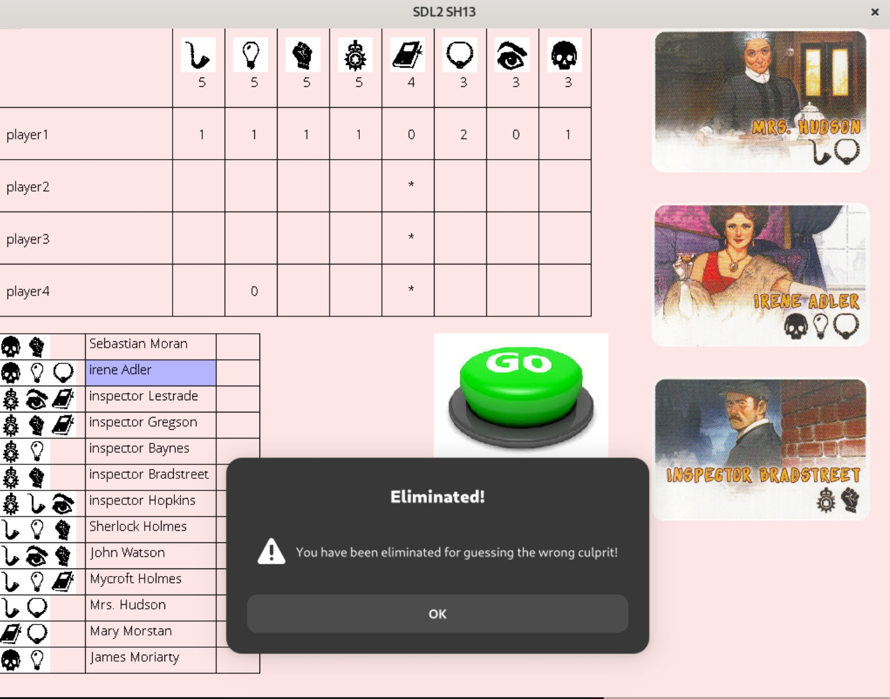

# SH13 - Jeu Sherlock Holmes 13

Ce projet est une implémentation du jeu Sherlock Holmes 13, un jeu de déduction où les joueurs doivent trouver le coupable parmi 13 personnages.

## Structure du projet

- `server.c` : Serveur du jeu qui gère la logique et les communications
- `sh13.c` : Client graphique utilisé par les joueurs
- `assets/` : Dossier contenant les images et polices utilisées par le jeu
- `cmd.sh` : Script pour lancer facilement le serveur et les clients
- `rapport.md` : Rapport détaillé sur la construction du projet

## Prérequis

- SDL2 et SDL2_image
- SDL2_ttf pour l'affichage du texte
- Compilateur C (GCC recommandé)

## Compilation

Pour compiler le serveur et le client :

```bash
./cmd.sh
```

## Exécution

### Lancement du serveur

```bash
./server [port]
```

Exemple : `./server 32000`

### Lancement d'un client

```bash
./sh13 [adresse_serveur] [port_serveur] [adresse_client] [port_client] [nom_joueur]
```

Exemple : `./sh13 localhost 32000 localhost 32001 Joueur1`

## Règles du jeu

1. Chaque joueur reçoit 3 cartes représentant des personnages
2. Une carte supplémentaire est le coupable
3. À tour de rôle, les joueurs peuvent :
   - Interroger tous les joueurs sur un objet
   - Interroger un joueur spécifique sur un objet
   - Accuser un personnage d'être le coupable
4. Si un joueur accuse à tort, il est éliminé
5. Le jeu se termine quand un joueur trouve le coupable ou qu'il ne reste qu'un joueur

## Fonctionnalités

- Interface graphique avec SDL
- Communication réseau via sockets TCP
- Architecture client-serveur
- Système d'élimination des joueurs
- Messages visuels pour l'état de la partie

## Capture d'écran


_Interface du jeu montrant le plateau de jeu avec les objets, les joueurs et les cartes des personnages_

## Auteur

Réalisé par Ali Soukarieh pour le module de OS
